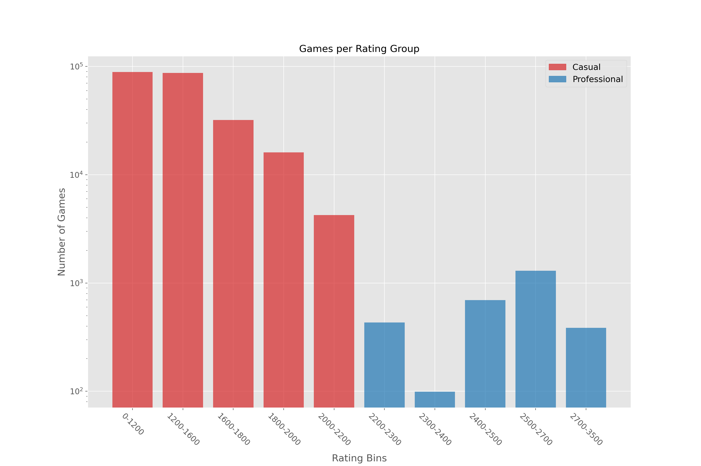

# The-Evolution-of-Chess
## Table of Contents
[Overview](#overview) 
[Data Preparation](#data-preparation) 
[Feature Engineering](#feature-engineering) 
[Exploratory Data Analysis](#exploratory-data-analysis) 
[Hypothesis Testing: Average Game Length over Time](#hypothesis-testing-average-game-length) 
[Future Questions](#future-questions) 
[References](#references) 

## Overview

Chess is an age-old game that traces back all the way to the 7th century. It has evolved over time with countless players studying the game and pushing the needle forward. The game started to advance more rapidly when chess engines were introduced in the 1950's. As engines improved, people improved by leveraging the knowledge of these engines to better study their own games. The culmination of all this progress brings us to today, where anyone can go online and play chess against other people and use an engine to immediately review their mistakes and successes from a game right after it concludes.

This project is an exploration of current chess trends and what is changing over time. It analyzes games spanning the last 5 years from a random subset of users playing at all levels from casual to professional. I perform exploratory data analysis and hypothesis testing to search for answers to the following questions:

1. How does the way people play chess differ across different skill levels?

2. What is the skill distribution across all chess players?

3. Is the game still changing?

The answers to these questions serve to provide a concise overview that can inform someone about the current state of chess at a cursory glance.

## Data Preparation

All of the data used for this project was pulled from the [Chess.com API](https://www.chess.com/news/view/published-data-api). The API is built in such a way that the largest form of data extraction for games is pulling all games for a specific month for any single player. In order to gather a sufficiently large dataset for this project, I needed a list of usernames. I began by collecting the usernames of all active players in Russia (~150,000). I took these usernames and randomly selected a 1500 person subset to pull games from.

Once a username list was established, I set a requirement that all players must have at least 3 months of games logged in their archives in order for their games to be pulled. Additonally, I set a requirement that the months of these games must be from the years 2015, 2018, or 2020. These decisions were made to ensure that the final dataset was rich with information and not skewed by one-time players with a small set of games. Furthermore, I wanted games that spanned a sizable period of time to analyze time-series data.

Applying these conditions resulted in a final list consisting of 383 players with 239,717 games played. The data that was extracted yielded the following dimensions:
- URL
- PGN ([Portable Game Notation](https://en.wikipedia.org/wiki/Portable_Game_Notation))
- FEN ([Forsyth-Edwards Notation](https://en.wikipedia.org/wiki/Forsyth%E2%80%93Edwards_Notation))
- Time Class
- Time Control
- Start Time
- End Time
- Rules
- White
- Black
- Rated

## Feature Engineering

The initial features that the API provided contained lots of valuable information that was nested and cluttered.

This was the most relevant with the PGN feature. Portable Game Notation is a format that predates computerized chess that has been used to capture all information about a chess game from moves played to who won to where the game took place. In order to flatten the feature and extract all desired pieces of information, I used the [chess.pgn Python library](https://python-chess.readthedocs.io/en/v1.4.0/pgn.html). In doing so, I was able to get the following columns:
- Total Moves
- Winner
- ECO ([Encyclopaedia of Chess Openings](https://en.wikipedia.org/wiki/Encyclopaedia_of_Chess_Openings))
- Date

There was an additional two columns, 'White' and 'Black', which contained player information in the form of dictionaries about both players. These were flattened to yield the following features:
- White Rating
- Black Rating
- Rating Difference
- Average Rating

These features proved to be much more useful for parsing through data and analyzing games.

## Exploratory Data Analysis

The table below shows summary statistics for each of the numerical features in the dataset.

From these statistics, it seemed that the vast majority of the playerbase was playing at ratings that are at or near the rating you start with when you make an account (1200). To explore this further, I created a bar chart that put players into meaningful rating buckets to see how the number of games played in the dataset was distributed.

As expected, the number of games drops drastically as we jump every 100-200 rating points. However, rather than following a linear descent all the way down, the number of games played forms a trough roughly in the 2200-2500 skill rating section. My initial impression as a chess player is that those ratings are often transitional for professional players who are climbing to reach the 2500+ rating bracket. This would require more analysis and a larger dataset specifically tailored to professional play to substantiate such a claim.

Following this analysis, I wanted to see if there were any apparent meaningful correlations between any of the numerical features.

While total moves showed a slight correlation to average rating, there were not any standout numbers that compelled me to look at them more closely.

I shifted my focus to look at individual player progression. Shown below are some example players and their rating progression over their lifetime on the website.

The final point I looked into during the EDA was openings. I was interested in seeing if there was a discernable difference in the openings people were using the most often.

## Hypothesis Testing

The question I had that I wanted to answer with this hypothesis test is, "Has the average number of moves made in a game of chess changed over time?" With that in mind, I formulated these null and alternative hypotheses:

**H0: There is no change in the number of moves made in chess games over time.**

**HA: There has been a change in the number of moves made in chess games over time.**

An alpha value of 0.05 was used in this hypothesis test to mitigate the chances of both a Type I and Type II error. Since I would be using the same year samples (2015, 2018, 2020) to conduct multiple hypothesis tests, I applied the Bonferroni Correction.

$$ \frac{\alpha}{n} = \frac{0.05}{2} = 0.025 $$

This yielded a new significance level of 0.025. The t-tests were then conducted using the Welch's adjustment since the sample sizes of games from each year varied greatly. The moves per game distributions of each sample used in the tests can be seen in the histogram below.

The resultant p-values from the t-tests were all statistically significant with values:

2015 vs 2018: 8.598593406221517e-11

2018 vs 2020: 5.061220391600291e-128

2015 vs 2020: 3.985461957690983e-78

With these results, I rejected the null hypothesis and concluded that the there has been a change in the number of moves made in chess games over time. The length of games tends to be trending downward with each coming year.

## Future Questions

After completing this project, there are still many areas of interest left that I would like to explore. Some questions that I would like to answer next are:
- Do players naturally improve over time?
- Amongst the most popular openings commonly used in chess, are some inherently better than others?
- Are there defining characteristics in playstyle that distinguish professional players from casual players?
- What is the distribution of the frequency of professional players with each professional title (CM, FM, IM, GM)?

## References

1. [Chess.com API](https://www.chess.com/news/view/published-data-api)
2. [History of Chess Computer Engines](https://chessentials.com/history-of-chess-computer-engines/)
3. [Portable Game Notation (PGN)](https://en.wikipedia.org/wiki/Portable_Game_Notation)
4. [Forsyth-Edwards Notation](https://en.wikipedia.org/wiki/Forsyth%E2%80%93Edwards_Notation)
5. [chess.pgn Python Library](https://python-chess.readthedocs.io/en/v1.4.0/pgn.html)
6. [Encyclopaedia of Chess Openings](https://en.wikipedia.org/wiki/Encyclopaedia_of_Chess_Openings)